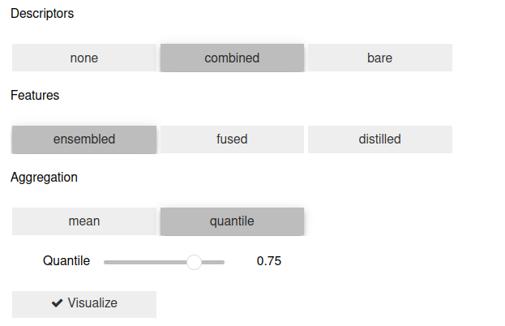

# Exploring Unsupervised Multimodal 3D Understanding
A project for the Praktikum "Advanced Topics in 3D Computer Vision". Here you can find our additions and experiments to 
the implementation of [OpenScene](https://pengsongyou.github.io/openscene).

## Installation
To run our code, follow the OpenScene [Installation Guide](../installation.md) first!

## (Simplified) Pipelines
To perform different steps from the OpenScene pipeline, we have extracted and modified code from their 
provided implementation. 

We have created jupyter notebooks to perform the following steps.

- [Perform multi-view feature fusion](notebooks/feature_fusion_scannet_openseg.ipynb) on 2D data
- [Extract 3D distilled features](notebooks/eval_simplified.ipynb)* from a pre-trained model
- [Distill 3D feature models](notebooks/distill_simplified.ipynb)* on new data from scratch

\* need to be launched in the original OpenScene repo

## Dataset Augmentation

To create interesting data with uncommon new objects, we inserted 3D models into scenes of the 
[ScanNet](http://www.scan-net.org/) dataset. The 3D models come from the [Objaverse](https://objaverse.allenai.org/) 
dataset. 

The augmentation entails all scene data.

- 2D RGB images
- 2D depth map
- 3D point cloud
- all corresponding ground truth labels

We implemented a [Dataset Augmenter class](scannet_augmentation/dataset_augmenter.py) alongside an
[example script](scannet_augmentation/augment_scene_chairs.py) to demonstrate the functionality. The scene generated by
this script is the chair scene used in one of the experiments and the live demo.

[Previous](notebooks/aug_projection.ipynb) [implementations](notebooks/scannet_aug.ipynb) can also be found in the 
notebooks directory.

## Experiments

For our experiments, we have used two different augmented scenes. We have inserted different
- bird species
- types of chairs

We extracted features for both scenes using the previously mentioned notebooks. To perform the experiments directly, 
please [download](https://drive.google.com/drive/folders/1DkFI6CFrMVSiFE5o7pssg-AHPXctCS_j?usp=drive_link) 
the fused and distilled features.

The _bird experiment_ can be run in the corresponding [notebook](notebooks/highlight_evaluate_birds.ipynb) or with the 
[script](experiments_bird.py).

The _chair experiment_ can be run in the corresponding [notebook](notebooks/highlight_evaluate_chairs.ipynb).

## Live Demo

The live demo from our workshop presentation is an [interactive jupyter notebook](notebooks/chairs_live_demo.ipynb).
You can visualize the result of the classification and the query similarity while being able to adjust the type of 
descriptors, features, and aggregation.

