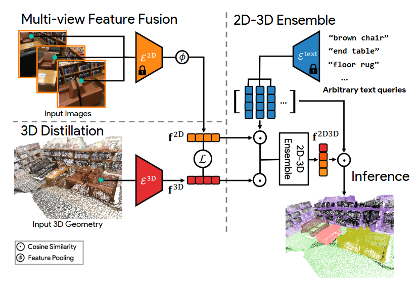
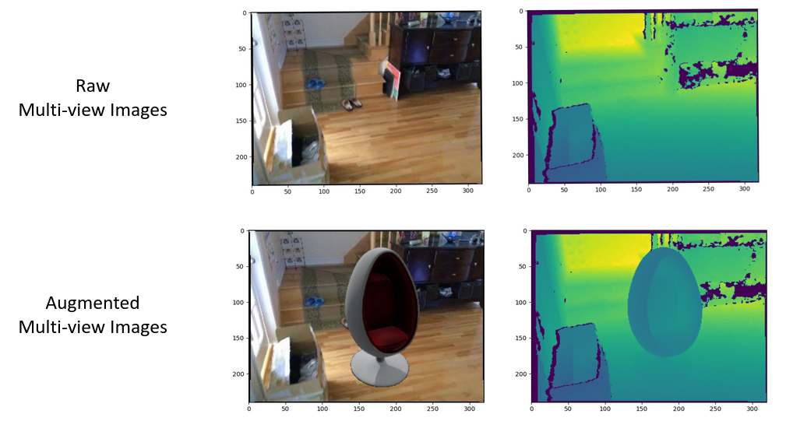

# Exploring Unsupervised Multimodal 3D Understanding
A project for the Praktikum "Advanced Topics in 3D Computer Vision".

## Installation
To run our code, follow the OpenScene [Installation Guide](../installation.md) first!

## (Simplified) Pipelines
To perform different steps from the OpenScene pipeline, we have extracted and modified code from their 
provided implementation. 

We have created jupyter notebooks to perform the following steps.

- [Perform multi-view feature fusion](notebooks/feature_fusion_scannet_openseg.ipynb) on 2D data
- [Extract 3D distilled features](notebooks/eval_simplified.ipynb)* from a pre-trained model
- [Distill 3D feature models](notebooks/distill_simplified.ipynb)* on new data from scratch

\* need to be launched in the original OpenScene repo

## Dataset Augmentation

To create interesting data with uncommon new objects, we inserted 3D models into scenes of the ScanNet dataset. The 3D 
models come from the Objaverse dataset. 

The augmentation entails all scene data.

- 2D RGB images
- 2D depth map
- 3D point cloud
- all corresponding ground truth labels

## Experiments

For our experiments, we have used two different augmented scenes. We have inserted different types of chairs and 
different bird species. We extracted features for both

[download](https://drive.google.com/drive/folders/1DkFI6CFrMVSiFE5o7pssg-AHPXctCS_j?usp=drive_link)

## Live Demo (from Workshop Presentation)

## Experiments
Either run the experiments on the [notebook](notebooks/highlight_evaluate_birds.ipynb) or with the [script](experiments_bird.py)

